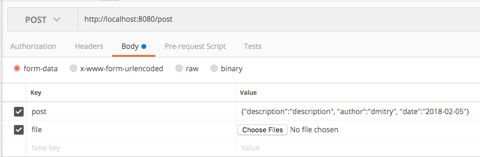

 Task 9 report.
 В рамках данного задания были реализованы следующие сервлеты:
 <ol>
     <li>LoginServlet/RegisterServlet - реализуют работу с юзерами.
         Пароли не хранятся в чистом виде, используется примитивное хэширование.
         При запросе на /login (method:post) данные отправляются как 2 параметра: 
         login и password.
         При запросе на /register (method:post) данные отправляются в формате json c ключом "user"(Например:{"login":"login","password":"111"}).
     </li>
     <li>PhotoPostServlet - реализует работу с отдельными фотопостами по id.
         В нем реализованы следующие функции:
         <ol>
             doGet()
                 <ul>
                     <li>url pattern - /post</li>
                     <li>request example - http://localhost:8080/post?id=1</li>
                 </ul>
             Возвращает объект фотопоста в формате json с указанным в запросе id.
             В случае ошибок (и во всех последующий сервлетах и методах) возвращает 
             специальный объект Message в виде json ({"status":"?","data":"?"}).
             Для получения фотографии фотопоста нужно сделать дополнительный запрос
             на /image?path={src} , где src - атрибут объекта фотопоста.
             Будет переделана в Restful ссылку.
         </ol>
         <ol>
            doPost 
                 <ul>
                     <li>url pattern - /post</li>
                     
                 </ul>
             Позволяет загрузить фотопост на сервер в указанном формате. 
             Запрос должен иметь следующие 2 ключа:
             <ul>
                <li>post = {"description":"description", "author":"dmitry", "date":"2018-02-05"}</li>
                <li>file = file.jpg</li>
             </ul>
             В случае успешной загрузки возвращает id фотопоста.
             
Примечание: На ОС windows с файловой системой NTFS может быть 
             проблема с сохранением файла (А может и с другим, понятия не имею
             как это фиксить во всех случаях) В таком случае нужно расскоментировать 
             все "//TODO: NTFS FILESYSTEM fix" участки кода.

         </ol>
         <ol>
            doDelete
                 <ul>
                     <li>url pattern - /post</li>
                     <li>request example - http://localhost:8080/post?id=1</li>
                 </ul>
             Позволяет удалить фотопост по указанному id.
             В cлучае успешного удаления возвращает статус 200.
         </ol>
     </li>
     <li>SearchServlet - реализует работу с коллекцией фотопостов.
         В нем реализованы следующие функции:
         <ol>
             doGet()
                 <ul>
                     <li>url pattern - /search</li>
                     <li>request example - http://localhost:8080/search?type=last&search=5</li>
                 </ul>
             Возвращает коллекцию фотопостов соответсвующие указанным параметрам.
             Доступные параметры:
             <ul>
                <li>type=last - получить последние загруженный n постов (search=n)</li>
                <li>type=author - получить фотопосты указанного автора (search=author)</li>
                <li>type=date - получить фотопосты по дате [формат даты: (yyyy-[m]m-[d]d)]</li>
                <li>type=hashtag - получить фотопосты по хэштегу, хэштэг должен быть без символа '#' (search=hashtag)</li>
             </ul>
         </ol>
     </li>
     <li>ImageServlet - реализует получение картики по указанаму атрибуту src объекта
        PhotoPost.
         <ul>
            <li>url pattern - /image?path=src</li>
            <li>request example - /image?path=img/filename, filename - имя загруженного файла с расширением.</li>
         </ul>
     </li>
 </ol>
 При разработке использовалсь база данных h2, не успел сделать инциализацию тестовых данных.
 Поэтому на старте база будет пустой.